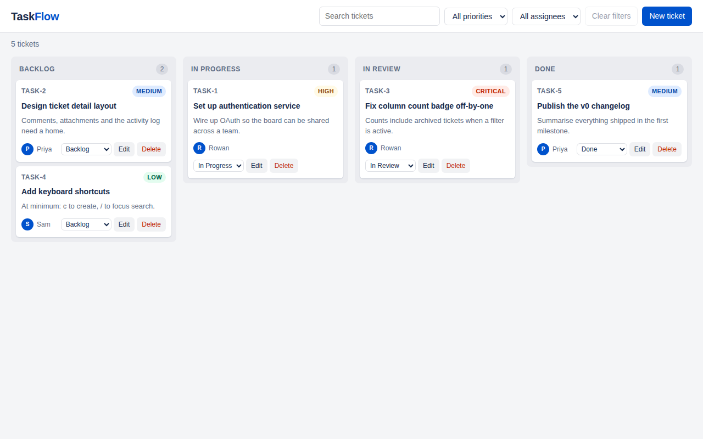

# TaskFlow-Project

Demo site for a Jira-like taskflow web app, keeping track of tickets — plus a
REST API and the Playwright suites that keep both honest.

**Testing framework: [Playwright](https://playwright.dev), for the browser tests
and the API tests alike. Selenium is not used anywhere in this repo.**



## What's here

```
app/                     the demo site (no build step, no runtime dependencies)
  index.html
  styles.css
  src/                   model, store, board rendering and the ticket dialog
    model.js             statuses, priorities and validation — shared with the API
server/                  dependency-free server: static site + REST API, one port
  static-server.js       entry point; serves app/ and mounts /api
  api.js                 JSON routes, status codes and error shapes
  ticket-repository.js   in-memory ticket store
e2e/
  data/                  ticket types, board vocabulary and seed/builder helpers
  fixtures/              the `test` object the UI specs import
  pages/                 page objects (BoardPage, TicketDialogPage)
  specs/                 browser tests
  api/                   API tests (no browser involved)
playwright.config.ts     projects, reporters, retries and the webServer wiring
```

## Running it

```bash
npm install
npm run dev          # http://localhost:4173
```

One process serves both the site and the API on the same port. The browser app
persists tickets to `localStorage`, so a reload keeps your board — clear the
`taskflow.tickets.v1` key to get the seed board back. The API keeps its own
board in server memory; the two are independent.

### Features

- A four-column board: Backlog → In Progress → In Review → Done
- Create, edit and delete tickets, with validation on title and assignee
- Move a ticket by dragging its card, or with the dropdown on the card
- Search across key, title and description; filter by priority and assignee
- Keyboard shortcuts: `c` to create a ticket, `/` to focus search

## The ticket API

The same server exposes a small REST API under `/api`. It exists so there is
something real to write API tests against — see
[API tests](#api-tests-e2eapi) below.

| Method   | Path                     | Notes                                                    |
| -------- | ------------------------ | -------------------------------------------------------- |
| `GET`    | `/api/health`            | `{ status, tickets }` heartbeat                           |
| `GET`    | `/api/tickets`           | List; filter with `?status=`, `?priority=`, `?assignee=`, `?q=` |
| `POST`   | `/api/tickets`           | Create; `201` plus a `Location` header                    |
| `GET`    | `/api/tickets/:key`      | Fetch one; `404` if unknown                               |
| `PATCH`  | `/api/tickets/:key`      | Partial update; `404` if unknown                          |
| `DELETE` | `/api/tickets/:key`      | Remove; `204` on success, `404` if already gone           |
| `POST`   | `/api/tickets/reset`     | Restore the seed board (demo and test helper)             |

Errors come back as `{ "error": "..." }`. Validation failures add a `fields`
object so a client never has to parse prose:

```json
{
  "error": "Ticket is not valid",
  "fields": {
    "title": "Title must be at least 4 characters",
    "status": "Unknown status: archived"
  }
}
```

Poke at it with `npm run dev` running:

```bash
curl localhost:4173/api/tickets
curl 'localhost:4173/api/tickets?assignee=Rowan&priority=critical'
curl -X POST localhost:4173/api/tickets \
  -H 'content-type: application/json' \
  -d '{"title":"Something to do","assignee":"Rowan","priority":"high"}'
curl -X PATCH localhost:4173/api/tickets/TASK-1 \
  -H 'content-type: application/json' -d '{"status":"done"}'
curl -X DELETE localhost:4173/api/tickets/TASK-1
curl -X POST localhost:4173/api/tickets/reset
```

Two things worth knowing:

- **Validation lives in one place.** `server/ticket-repository.js` imports
  `validateTicket` and the status/priority vocabulary from `app/src/model.js`,
  the same module the browser UI uses, so the API and the UI cannot drift apart
  on what counts as a valid ticket. A `PATCH` is validated on the record it
  would *produce*, not on the handful of fields the caller happened to send.
- **State is in memory and shared.** Restarting the server, or calling
  `/api/tickets/reset`, returns the board to its seed. That is fine for a demo
  and it shapes how the API tests are written.

## Running the tests

```bash
npm test                 # every project: browser + API
npm test -- --project=chromium
npm test -- --project=api      # API tests only; no browser needed
npm run test:ui          # Playwright's watch-mode UI
npm run test:headed
npm run test:debug
npm run report           # open the HTML report from the last run
```

`playwright.config.ts` starts the static server itself, so there is nothing to
launch first. `reuseExistingServer` is on outside CI, so a `npm run dev` you
already have running is picked up instead of a second one being spawned.

If this is a fresh checkout you'll need the browsers once:

```bash
npx playwright install --with-deps
```

### Projects

`api` runs the API tests and never launches a browser, so it works on a checkout
with no browsers installed at all. The rest are browser projects: `chromium` and
`mobile-chrome` run by default, since that is what most machines have. Set
`PW_ALL_BROWSERS=1` to add Firefox and WebKit — that's what CI does:

```bash
PW_ALL_BROWSERS=1 npm test
```

Tests that only make sense with a pointer (drag and drop) skip themselves on the
mobile project via `test.skip(({ isMobile }) => ...)`.

### Playwright version

`@playwright/test` is pinned to an exact version rather than a range. Each
Playwright release bundles a specific browser build, so a floating range means
the browsers on disk silently drift out of step with the library. Bump the pin
and re-run `npx playwright install` together.

## How the suite is put together

**Import `test` from the fixtures, not from `@playwright/test`.**

```ts
import { test, expect } from '../fixtures/taskflow.js';

test('moves a card into the chosen column', async ({ board }) => {
  await board.goto();
  await board.moveTicket('TASK-2', 'in_progress');
  expect(await board.keysIn('in_progress')).toEqual(['TASK-1', 'TASK-2']);
});
```

`e2e/fixtures/taskflow.ts` supplies the `board` and `ticketDialog` page objects
and wraps `page` in a guard that fails any test which logged a console error or
threw on the page — assertions passing is not the same as the app being happy.

**Seed the board instead of clicking it into shape.** `BoardPage.gotoWith()`
writes tickets into `localStorage` via `addInitScript` before app code runs, so
a test that cares about one edge case doesn't spend ten actions building up to
it:

```ts
await board.gotoWith([buildTicket({ key: 'TASK-42', status: 'review' })]);
```

Each test gets its own browser context, so storage starts clean every time and
`fullyParallel` is safe.

**Locators favour what a user can see.** Columns are found by their accessible
region name, buttons and fields by role and label. `data-testid` is reserved for
structural nodes with no meaningful role — cards, columns, the toast — and for
addressing a ticket by its key, which is its identity.

**Assertions are web-first.** `expect(locator).toHaveText(...)` and friends
retry, so there are no `waitForTimeout` calls in the suite.

### API tests (`e2e/api`)

These use Playwright's `request` fixture — an HTTP client that picks up
`baseURL` from the config — so they never start a browser:

```ts
test('404s on an unknown key', async ({ request }) => {
  const response = await request.get('/api/tickets/TASK-9999');

  expect(response.status()).toBe(404);
  expect(await response.json()).toEqual({ error: 'Ticket TASK-9999 not found' });
});
```

They cover the things API tests exist to cover and UI tests cannot: status
codes, response headers (`Location`, `Allow`, `Cache-Control`), the exact shape
of the JSON contract, validation and error payloads, `404`s, `405`s, malformed
request bodies, and whether a rejected write left the collection alone.

**Isolation is the interesting part.** A browser test gets its own context and
therefore its own `localStorage`, which is why the UI suite can run
`fullyParallel`. The API is one process holding one shared board, so:

- every API test `POST`s to `/api/tickets/reset` first, and
- the `api` project sets `fullyParallel: false`, and all the API tests live in
  a single file — Playwright gives one file to one worker, so nothing else can
  mutate the board mid-test.

A production service would isolate differently: a transaction rolled back per
test, or a schema or tenant per worker. The mechanism differs, the rule does
not — **a test must control the state it asserts on**. Reaching for
`fullyParallel: false` is the right call when state is genuinely shared, and the
wrong one when it is just masking tests that leak into each other.

**Raw bodies need a `Buffer`.** Passing a string to `data` lets Playwright
JSON-encode it, so `'{ not json'` arrives as a valid JSON *string*. To test that
the server rejects malformed JSON, send `Buffer.from('{ not json')`.

## Continuous integration

`.github/workflows/e2e.yml` type-checks the suite, then runs the API tests plus
the browser tests across Chromium, Firefox and WebKit on every push and pull
request. Browser downloads are cached
against the pinned Playwright version. The HTML report is uploaded on every run
and traces are uploaded on failure — download the report artifact and run
`npx playwright show-report path/to/extracted-report` to step through it.

On CI the suite also runs with `forbidOnly` and two retries; `trace` is captured
on the first retry so a flaky failure arrives with a full timeline attached.
